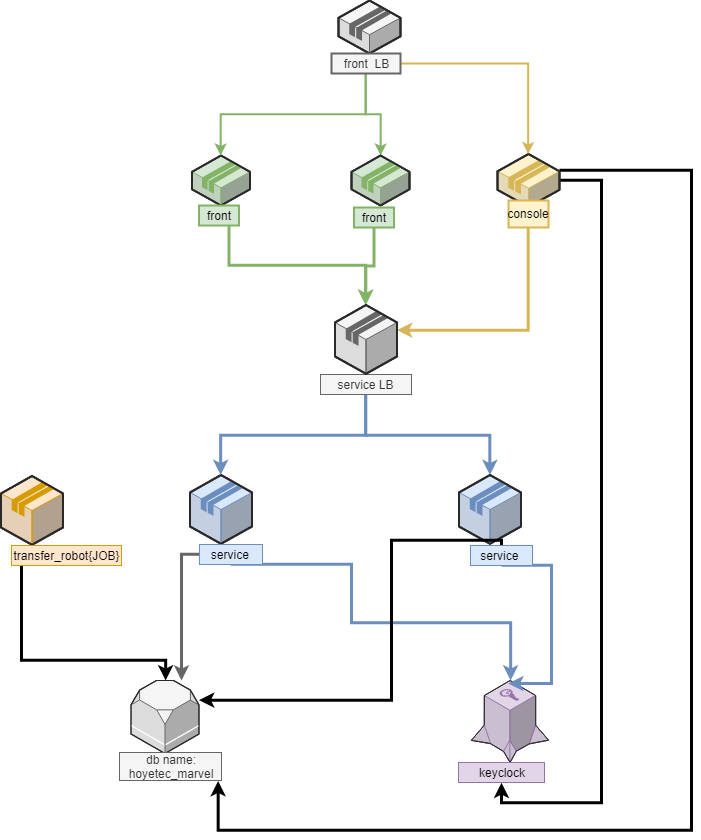

**海威案，支援交易所 and 商城**

**官網網址**
https://www.solo-coin.com/

系統架構

- 
 

**專案目錄說明**

- front
前台WEB程式
- console 
後台WEB程式
- service 
API 程式
- transfer_robot
Schedule JOB程式
- database
db schema
- keyclock
keyclock設定文件
- proxy
proxy設定文件
- doc
需求相關文件

**開發環境**
- JDK 1.8
- Spring STS 4
- Grails 4.0
- Mysql 5.7+


**寫碼標準(盡量遵守)**

- 原始檔的編碼格式使用 UTF-8
- 以tab(設定四個空白)來當一個縮排的單位。
- 避免行長度超過 132 字元, 超過請折行。
- Package 名稱全部小寫，連續單字直接寫在一起(不用下底線(_))。
```
X import java.util.*;
O import java.util.List;
```
- 類別名稱採用大寫開始的駝峰命名法(UpperCamelCase)。
- 類別名稱由每個內部單字開頭字母皆為大寫的混和字組成。
- 類別常數的變數名稱應該是以("_")底線分隔的全大寫字。
```
private static final String SOME_STATIC_CONST = "xxxxx";
```
- 函式名稱採用小寫開始的駝峰命名法(lowerCamelCase), 並且要取有意義的名稱。
- 在if、else、for、do以及while這些敘述裡的程式碼，就算是空的，或是僅有一行，也都要使用大括號。
- if/else/while .. 等, 與 () 間有一個空白
- ()內的參數, 若有 "," 隔開, 則 "," 後面要空一格
- =,>,<,&&,||, == .. 等 判斷條件, 前後要空格
- 判斷式裡若有多個and/or條件, 需用括號來明確指出判斷順序
- 一般變數(Variables)：其名稱應該表示該變數的含意，最前面為全小寫的變數型態，第二個以後的字為第一個字母大寫的混合字串。不能用底線符號(＿)並避免使用錢字符號(＄)。
- 變數定義需要於右方加註解，尤其是有縮寫的變數名稱
- 所有公開類別 (public class) 以及每個類別 (class) 中公開 (public) 或被保護的(protected) 成員都該寫上 Javadoc
- 在子類別中覆寫的父類別的方法也寫上Javadoc，並說明與父類別方法的差異之處。
- 於每一個java程式(*.java)與JSP頁面，都包含程式表頭，用以說明該程式/網頁之程式名稱，程式主題，程式說明，版權聲明，開發公司名稱，作者，開發完成日期，最近維護/修改人，最近一次修改日期等該程式之相關資訊，以提供說明，查詢與檢核之用。
```
/**
*****************************************************************************
*
*    Page/Class Name:
*              Title:
*        Description:
*          Copyright:
*            Company:
*        Create Date:
*      Last Modifier: $Author$
*   Last Modify Date: $Date$
*            @author  $Author$
*
*****************************************************************************
*/
```